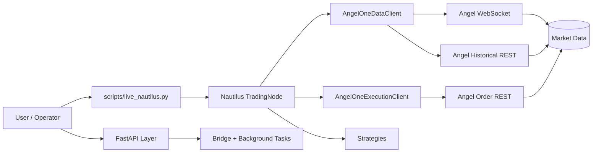
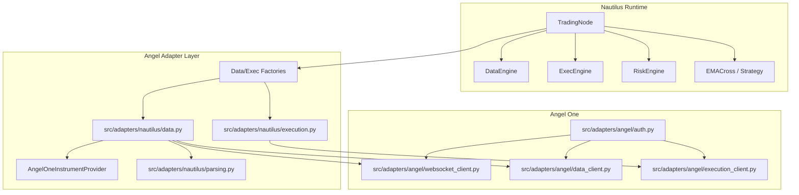
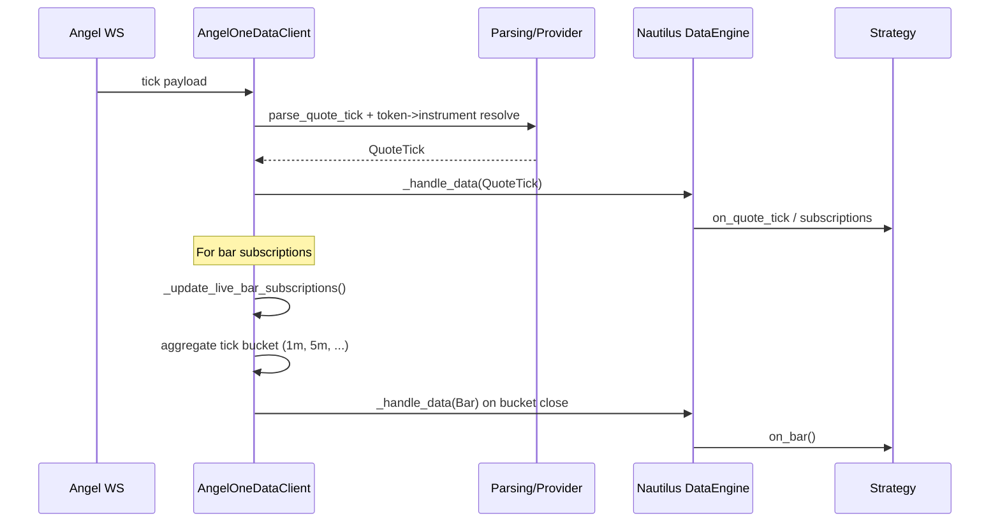
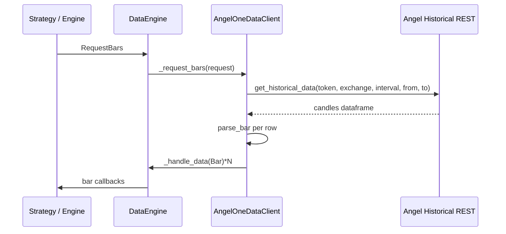
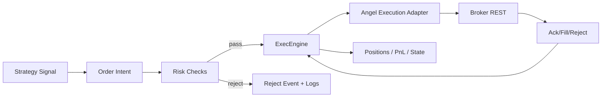
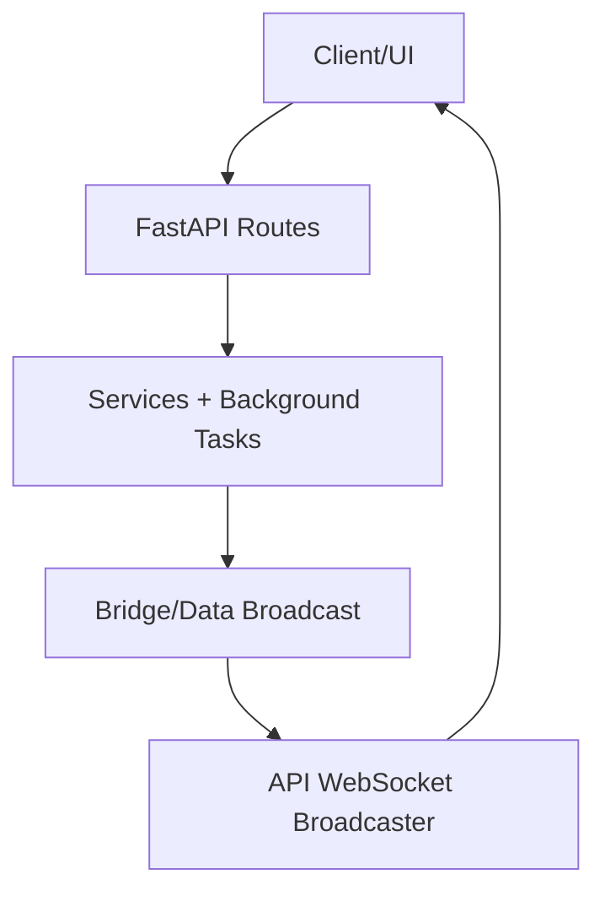
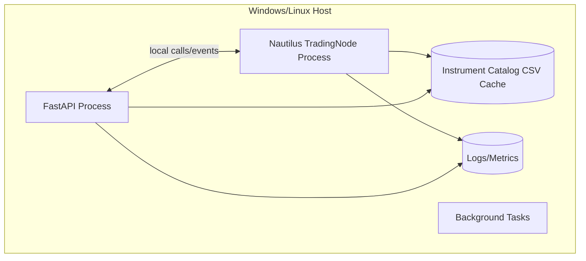

# System Diagrams, Architecture, and Data Flow

Date: 2026-02-19  
Scope: Current Nautilus + Angel One integration in this repository (paper/live-safe mode).

## 1. System Context

## 2. Runtime Component Architecture

## 3. Live Market Data Flow (Tick -> Strategy)

Key implementation points:
- Subscription entry: `src/adapters/nautilus/data.py:_subscribe_bars`.
- Token routing map: provider-managed (`instrument_id -> token`) in `src/adapters/nautilus/providers.py`.
- Tick normalization and timestamp handling in `src/adapters/nautilus/parsing.py` and `src/adapters/nautilus/data.py`.

## 4. Historical Data Flow

## 5. Execution and Risk Gatekeeping Flow

Current status:
- Live script currently runs SAFE MODE without execution client wiring by default.
- This keeps data/strategy runtime verifiable without broker-side order placement.

## 6. API + Bridge Flow (control plane)

Primary relevant files:
- `src/api/main.py`
- `src/api/routes/orders.py`
- `src/api/services/background_tasks.py`
- `src/bridge/data_bridge.py`

## 7. Deployment View (single-host baseline)

## 8. Reliability and Failure Handling

- WS disconnect:
  - reconnect path via Angel auth + websocket client.
  - subscription map must be replayed after reconnect.
- Broker/auth expiry:
  - auth manager re-auth flow refreshes session.
- Graceful shutdown:
  - node stop triggers queue cancellations (expected warnings in Nautilus logs).
- Data integrity:
  - provider token mapping avoids mutable instrument attribute assumptions.
  - normalization layer handles timestamp and paise/price conversion edge cases.

## 9. Performance and Optimization Focus

- Hot path:
  - WS tick parse -> quote publish -> optional bar aggregation.
- Keep allocations minimal in `_process_tick` and bar update loop.
- Avoid repeated symbol resolution lookups by caching token->instrument mapping.
- Add metrics counters:
  - ticks received/sec
  - bars emitted/sec
  - WS reconnect count
  - parse failures

## 10. Security and Operational Controls

- Secrets only via environment variables (`ANGEL_API_KEY`, `ANGEL_CLIENT_CODE`, etc.).
- No credentials in code/docs.
- Keep execution disabled unless explicit `--enable-execution` control and risk caps are active.
- Audit logs for order intents and risk decisions before enabling live execution.

## 11. Gaps and Next Implementation Steps

1. Add explicit unsubscribe handlers in `src/adapters/nautilus/data.py`.
2. Add live-bar emission test with mocked tick stream.
3. Add startup/shutdown health summary in `scripts/live_nautilus.py`.
4. Add structured metrics export for adapter and strategy loops.
5. Verify 70+ second market run to confirm emitted 1-minute bars in active market conditions.
